# PickForge 🏈

> **NFL Pick 'Em Prediction Engine** — Statistical analysis meets game-day picks

A modern .NET 8 application that predicts NFL game outcomes using offensive/defensive statistics and recent form trends. Built with ASP.NET Core Web API and Blazor WebAssembly.

[](https://dotnet.microsoft.com/)
[](LICENSE)

---

## 🎯 TL;DR

```bash
# Clone and run locally (requires .NET 8 SDK)
git clone <your-repo-url>
cd PickForge

# Terminal 1: Start API
cd src/PickForge.Api
dotnet run --launch-profile https

# Terminal 2: Start Client
cd src/PickForge.Client
dotnet run --launch-profile https

# Open browser: https://localhost:7256
```

**What it does:** Fetches live NFL data from ESPN, analyzes team statistics, and predicts winners with confidence scores.

---

## ✨ Features

- **Live NFL Data** — Real-time schedules and scores from ESPN API
- **Statistical Predictions** — Weighted algorithm combining season stats + recent form
- **Clean Architecture** — Stateless design, no database required
- **Modern Stack** — .NET 8, Blazor WASM, minimal dependencies
- **Rate Limited** — 60 requests/minute per IP
- **Production Ready** — Docker + AWS deployment via GitHub Actions

---

## 🏗️ Architecture

```mermaid
graph LR
    User[👤 User] --> Client[Blazor WASM<br/>Client]
    Client -->|HTTPS| API[ASP.NET Core<br/>Web API]
    API -->|HTTP| ESPN[ESPN API<br/>Live Data]
    
    API --> Pred[PredictionService<br/>Algorithm]
    API --> Stats[StatsService<br/>Aggregation]
    API --> Score[ScoreboardService<br/>HTTP Client]
    
    style Client fill:#e1f5ff
    style API fill:#fff4e1
    style Pred fill:#ffe1e1
    style ESPN fill:#e1ffe1
```



### Project Structure

```
PickForge/
├── src/
│   ├── PickForge.Api/          # ASP.NET Core Web API
│   │   ├── Program.cs          # Minimal API entry point
│   │   ├── Models/             # DTOs and domain models
│   │   └── Services/           # Business logic
│   │       ├── PredictionService.cs   # Core algorithm
│   │       ├── ScoreboardService.cs   # ESPN API client
│   │       └── StatsService.cs        # Stats aggregation
│   └── PickForge.Client/       # Blazor WebAssembly
│       ├── Program.cs          # Client entry point
│       ├── Pages/              # Razor components
│       └── Models/             # Client-side DTOs
├── scripts/                    # Deployment scripts
└── .github/workflows/          # CI/CD automation
```

---

## 🚀 Quick Start

### Prerequisites

- [.NET 8 SDK](https://dotnet.microsoft.com/download/dotnet/8.0) (8.0.100 or later)
- Windows, macOS, or Linux
- Internet connection (for ESPN API)

### Local Development

#### Option 1: Manual (Two Terminals)

```bash
# Terminal 1: API
cd src/PickForge.Api
dotnet run --launch-profile https
# API runs at https://localhost:7004

# Terminal 2: Client
cd src/PickForge.Client
dotnet run --launch-profile https
# Client runs at https://localhost:7256
```

#### Option 2: Visual Studio / Rider

1. Open `PickForge.sln`
2. Set **Multiple Startup Projects**: `PickForge.Api` + `PickForge.Client`
3. Press `F5` (Debug) or `Ctrl+F5` (Run)

### Verify Setup

```bash
# Health check
curl https://localhost:7004/ping
# Expected: {"ok":true}

# Get predictions
curl "https://localhost:7004/predict?recent=3"
# Returns JSON with upcoming week predictions

# Open client: https://localhost:7256
```

---

## 🧮 How It Works

### Prediction Algorithm

PickForge uses a **weighted linear model** to predict game outcomes:

```
Rating = (PPG × 0.5) + (-PAPG × 0.4) + (Trend × 0.1)
```

**Inputs:**
- **PPG** (Points Per Game) — Season offensive average
- **PAPG** (Points Against Per Game) — Season defensive average (negated)
- **Trend** — Recent form vs. season average (last N games, configurable 1-10)

**Output:**
- **Pick** — Team with higher rating
- **Confidence** — 50-90% (scaled via `tanh` function based on rating difference)

**Example:**
```
Home: 28.0 PPG, 21.0 PAPG, +1.3 trend → Rating: 5.73
Away: 26.0 PPG, 22.0 PAPG,  0.0 trend → Rating: 4.20
Pick: Home (56% confidence)
```

### Data Flow


**Algorithm Details:**
- Fetches all completed weeks to calculate season averages
- Computes recent form by comparing last N games to season average
- Applies weights: 50% offense, 40% defense, 10% momentum
- Confidence scales with rating difference (larger gap = higher confidence)
- Handles edge cases: missing stats, ties, low sample sizes

---

## 📡 API Reference

### Base URL
- **Local:** `https://localhost:7004`
- **Production:** Set via `ASPNETCORE_URLS` environment variable

### Endpoints

#### `GET /ping`
Health check endpoint.

**Response:**
```json
{"ok": true}
```

#### `GET /predict`
Get predictions for upcoming NFL week.

**Query Parameters:**
| Parameter | Type | Default | Description |
|-----------|------|---------|-------------|
| `recent` | int | 3 | Number of recent games to factor (1-10) |

**Response:**
```json
{
  "Week": 10,
  "LastCompletedWeek": 9,
  "RecentGames": 3,
  "Count": 14,
  "Games": [
    {
      "GameId": "401671760",
      "Kickoff": "2024-11-10T18:00:00Z",
      "AwayTeam": "BUF",
      "HomeTeam": "KC",
      "Pick": "KC",
      "Confidence": 0.561,
      "Home": {"Wins": 7, "Losses": 2, "PPG": 28.0, "PAPG": 21.0},
      "Away": {"Wins": 6, "Losses": 3, "PPG": 26.0, "PAPG": 22.0},
      "Notes": "Season Off/Def plus last 3 games trend..."
    }
  ]
}
```

**Rate Limit:** 60 requests/minute per IP

**Swagger UI:** Available at `/swagger` when running locally

---

## 🛠️ Development

### Build & Test

```bash
# Build entire solution
dotnet build

# Run tests (when test project exists)
dotnet test

# Format code
dotnet format
```

### Configuration

**API Environment Variables:**
| Variable | Default | Description |
|----------|---------|-------------|
| `ASPNETCORE_ENVIRONMENT` | `Development` | Environment name |
| `ASPNETCORE_URLS` | `https://localhost:7004` | Listening URLs |

**Client Configuration:**
- API base URL configured in `Program.cs` (hardcoded for local dev)
- Production: Set via `appsettings.Production.json`

### Debugging

- **Visual Studio/Rider:** Set breakpoints, press `F5`
- **VS Code:** Install C# Dev Kit, use `.vscode/launch.json`
- **Browser DevTools:** Blazor WASM runs client-side, use console/network tabs

---

## ☁️ Deployment

### AWS Architecture (Production)

**Infrastructure:**
- **API:** AWS App Runner (containerized, auto-scaling)
- **Client:** S3 + CloudFront CDN (static hosting)
- **Secrets:** AWS Secrets Manager
- **CI/CD:** GitHub Actions (automated deployments)

**Deployment Steps:**

1. **Prerequisites:**
   ```bash
   # Install AWS CLI
   aws configure
   
   # Install Docker
   docker --version
   ```

2. **Manual Deployment (First Time):**
   ```bash
   # Build and push API
   ./scripts/build-and-push-api.sh
   
   # Deploy client
   ./scripts/deploy-client.ps1
   ```

3. **Automated Deployment:**
   - Push to `main` branch triggers GitHub Actions
   - Workflow builds Docker image, pushes to ECR
   - Updates App Runner service
   - Deploys client to S3, invalidates CloudFront cache

**Required GitHub Secrets:**
- `AWS_ACCESS_KEY_ID`
- `AWS_SECRET_ACCESS_KEY`
- `AWS_REGION`
- `ECR_REPOSITORY`
- `APP_RUNNER_SERVICE_ARN`

**Cost Estimate (MVP):**
- App Runner: ~$25-50/month (1 instance, 1 vCPU, 2GB RAM)
- S3 + CloudFront: ~$5-10/month (low traffic)
- **Total: ~$30-60/month**

### Docker (Local Testing)

```bash
# Build API image
docker build -t pickforge-api:latest -f src/PickForge.Api/Dockerfile .

# Run API container
docker run -p 7004:8080 pickforge-api:latest

# Test
curl http://localhost:7004/ping
```

**Client Dockerfile:** Not yet implemented (static files can be served directly)

---

## 🤝 Contributing

1. Fork the repository
2. Create a feature branch (`git checkout -b feature/amazing-feature`)
3. Commit your changes (`git commit -m 'Add amazing feature'`)
4. Push to the branch (`git push origin feature/amazing-feature`)
5. Open a Pull Request

**Before submitting:**
- Run `dotnet test` (ensure all tests pass)
- Run `dotnet format` (consistent code style)
- Update README if adding features

---

## 📄 License

This project is licensed under the MIT License - see the [LICENSE](LICENSE) file for details.

---

## 🙏 Acknowledgments

- **ESPN API** — Live NFL data source
- **.NET Team** — Excellent framework and tooling
- **Blazor Community** — WebAssembly innovation

---

**Built with ❤️ using .NET 8**